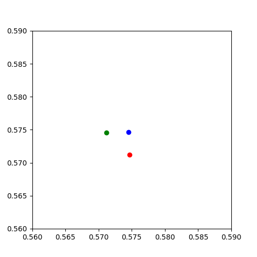
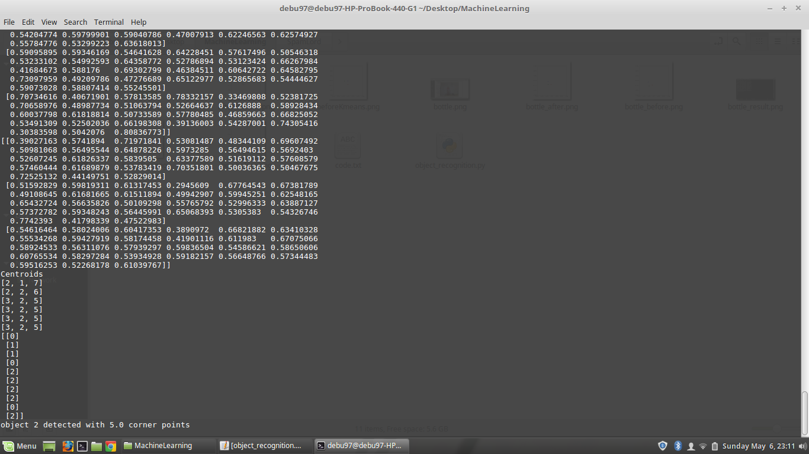

# Object Localization using Bag of Visual Words

This is project done under Machine Learning course at [Indian Institute of Space Science
and Technology](https://iist.ac.in). 

This project aims to detect and localize significant objects in a real time moving frame (eg. live capture from laptop's front cam).

## Prerequisites
Following libraries have been used in this project:
Matplot library
Glob2
Imageio
Numpy
Scipy
Math

## Step 1: Corner Detection
The code utilizes OpenCV's Harris Corner detector to locate key points in the input image (captured frame of laptop's front camera). The number of key points(corners) can be varied. These corners are plotted on the original image.

## Step 2: Feature Extraction
The next step involves constructing a square patch around each corner point and then it is passed to HOG feature descriptor. Gradients and magnitude are calculated for each image patch. Magnitudes are added for each bin range of gradient direction and then assembled into that. A histogram of features is obtained. Running this for all image patches followed by normalization in all RGB channels will give a feature space.
## Step 3: CLustering
K means clustering is used to group similar feature points. Similarity between feature points is decided on the minimal of distance of each feature point and centroid of the class. K can be varied. K represents the total no. of clusters(objects).

## Step 4: Labelling
The featured vectors are then matched correspondingly to their corner points and then the clusters of feature space is converted into clusters of corner points. Probability of each cluster is calculated and highest probability is termed as most significant object.

## Step 5: Localization
The final step is plotting of most significant object which is plotting the highest probable cluster of cornered points on the input image.

